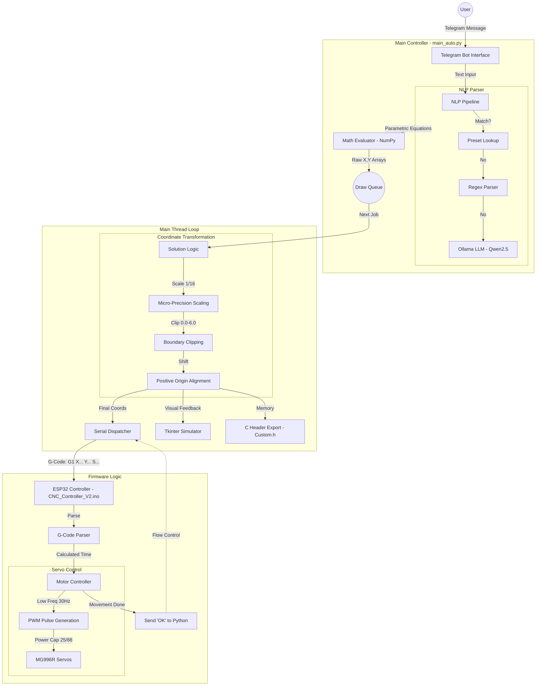

# CNC Plotter Software Architecture & Flow Diagram

This document outlines the software flow of the CNC Controller project, from user input to physical motor movement.

## 1. High-Level Flow Diagram (Mermaid)

## 2. Detailed Software Components

### A. NLP Pipeline (Input Interpretation)
- **Preset Lookup**: Checks if the user typed a known shape name (e.g., "heart", "circle").
- **Regex Parser**: Handles direct mathematical equations (e.g., `y = sin(x)`).
- **Ollama (Qwen2.5)**: Uses local LLM to interpret complex natural language requests and convert them into JSON parametric equations.

### B. Coordinate Transformation (Precision Layer)
- **1/16 Scaling**: All input units are divided by 16 for micro-drawings.
- **Safety Clipping**: Forcefully limits coordinates to a `[0.0, 6.0]` range.
- **Center Alignment**: Automatically shifts shapes to fit within the active zone.

### C. Serial Communication (G-Code)
- **Baud Rate**: 115200 bps.
- **Protocol**: Custom simplified G-code (`G1 X... Y... S...`).
- **Synchronization**: Uses a "Wait-for-OK" handshake to ensure the hardware doesn't get overwhelmed.

### D. Hardware Control (ESP32 Firmware)
- **Low Frequency Mode**: 30Hz PWM prevents mechanical resonance in MG996R servos.
- **Velocity Management**: Proportional power calculation for straight-line diagonal moves.
- **Power Limiting**: Caps servo duty cycle swing to 25 (out of 88) for stability with large 6.7cm wheels.
